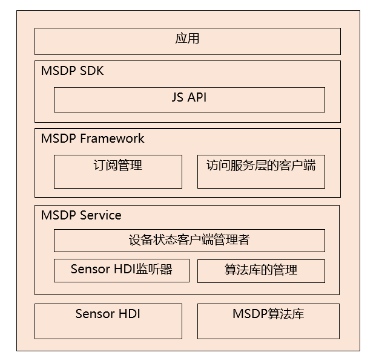

# MSDP设备状态感知框架<a name="ZH-CN_TOPIC_0000001148682248"></a>

-   [简介](#section_device_status_introduction)
-   [目录](#section_device_status_directory)
-   [约束](#section_device_status_constraint)
-   [使用](#section_device_status_usage)

## 简介<a name="section_device_status_introduction"></a>

MSDP设备状态感知框架能够识别出目前设备的状态并传递给订阅者，整个框架是基于MSDP算法库和系统SensorHDI组件组成的，将其接收到的感知时间传递给订阅者。根据感知用途分为以下三大类：

-   绝对静止类：利用加速度、陀螺仪等传感器信息识别设备处于绝对静止状态。
-   水平/垂直姿态类：利用加速度、陀螺仪等传感器信息识别设备处于绝对静止状态。
-   皮套开合事件感知：基于霍尔传感器识别皮套的开合的状态。

MSDP设备状态感知架构图如下所示：

**图 1**  MSDP设备状态感知架构图


## 目录<a name="section_device_status_directory"></a>

MSDP设备状态感知框架的示例代码如下：

```
/base/msdp/device_status
├── frameworks                 # 框架代码
│   └── native                 # device status客户端代码          
├── interfaces                 # 对外接口存放目录
│   ├── innerkits              # device satus innerkits API
│   └── kits/js                # Js API
├── sa_profile                 # 服务名称和服务的动态库的配置文件
├── services                   # 服务的代码目录
│   └── native/src             # device status服务代码
└── utils                      # 公共代码，包括权限、通信等能力
```

## 约束<a name="section_device_status_constraint"></a>

要使用MSDP设备状态感知功能，设备必须具有对应的传感器器件和相应的MSDP算法库。


## 使用<a name="section_device_status_usage"></a>

本模块当前仅提供inner接口给其他系统应用，暂未提供应用js接口。
